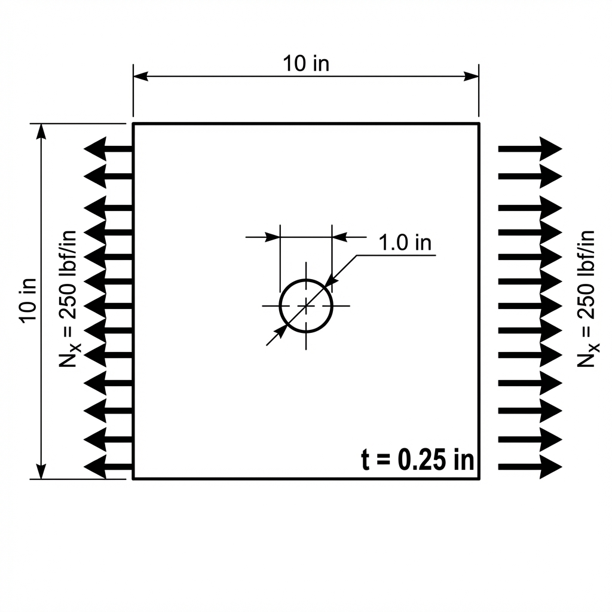

Getting Started: Isotropic Plate Example
========================================

This example walks through setting up a simple stress analysis for a square isotropic plate with a circular cutout in the center, subjected to uniaxial tension. In Panelyze, boundary condition inputs default to **running loads** (e.g., $lbf/in$), which is standard for thin-panel aerospace analysis.

Problem Description
-------------------

We will analyze a 10.0 in x 10.0 in square plate with a 1.0 in diameter hole (radius :math:`R = 0.5 \text{ in}`) at the center. The panel thickness is **0.25 in**. The material is aluminum (isotropic), and we apply a **250 lbf/in** running load to the horizontal edges (equivalent to 1,000 psi stress).

Free Body Diagram (FBD)
-----------------------

Simulation Workflow
-------------------

The following chart outlines the process for setting up and solving a problem in Panelyze:

.. mermaid::

   graph TD
       A[Material Definition] --> B[Geometry Creation]
       B --> C[Boundary Discretization]
       C --> D[Matrix Assembly]
       D --> E[Apply BCs & Constraints]
       E --> F[Solve Unknowns]
       F --> G[Extract Results]

Step-by-Step Implementation
---------------------------

1. Define the Material
~~~~~~~~~~~~~~~~~~~~~~

For an isotropic material, we set :math:`E_1 = E_2` and calculate :math:`G_{12}` from :math:`E` and :math:`\nu`. We specify a thickness of 0.25 in.

.. code-block:: python

   import numpy as np
   from panelyze.analysis.material import OrthotropicMaterial

   E = 10.0e6  # psi (Aluminum)
   nu = 0.33
   G = E / (2 * (1 + nu))

   # Use pseudo-isotropic modulus to avoid Lechenitskii singularity
   mat = OrthotropicMaterial(e1=E, e2=E*1.001, nu12=nu, g12=G, thickness=0.25)

2. Create Geometry and Mesh
~~~~~~~~~~~~~~~~~~~~~~~~~~~

Define the panel dimensions and add a circular cutout.

.. code-block:: python

   from panelyze.analysis.geometry import PanelGeometry, CircularCutout

   W, H = 10.0, 10.0
   radius = 0.5
   geom = PanelGeometry(W, H)
   geom.add_cutout(CircularCutout(x_center=W/2, y_center=H/2, radius=radius))

   # Discretize the boundary
   n_side = 20
   elements = geom.discretize(num_elements_per_side=n_side, num_elements_cutout=80)

3. Assemble and Solve
~~~~~~~~~~~~~~~~~~~~~

Using the `BEMKernels` and `BEMSolver`. By default, the `solve` method treats BC values as running loads ($lbf/in$).

.. code-block:: python

   from panelyze.analysis.kernels import BEMKernels
   from panelyze.analysis.solver import BEMSolver

   kernels = BEMKernels(mat)
   solver = BEMSolver(kernels, geom)
   solver.assemble()

   # Define Boundary Conditions (BCs)
   num_dofs = 2 * len(elements)
   bc_type = np.zeros(num_dofs, dtype=int)  # 0 = Traction (Running Load) given
   bc_value = np.zeros(num_dofs)

   # 1. Apply Running Load BCs (250 lbf/in Tension)
   q_applied = 250.0
   for i, el in enumerate(elements):
       if np.isclose(el.center[0], 0.0): # Left Edge
           bc_value[2*i] = -q_applied
       elif np.isclose(el.center[0], W): # Right Edge
           bc_value[2*i] = q_applied

   # 2. Apply Displacement BCs (Corner Constraints)
   bc_type[0:2] = 1
   bc_value[0:2] = 0.0

   k_br = n_side - 1
   bc_type[2*k_br + 1] = 1
   bc_value[2*k_br + 1] = 0.0

   u, t = solver.solve(bc_type, bc_value)

4. Extract Results
~~~~~~~~~~~~~~~~~~

Evaluate the stress ($psi$) and force resultants ($lbf/in$) at the stress concentration point.

.. code-block:: python

   # Point at theta=90 deg relative to hole center (r=0.51 in)
   eval_pt = np.array([[W/2, H/2 + 0.51]])
   stresses = solver.compute_stress(eval_pt, u, t)
   resultants = solver.compute_resultants(eval_pt, u, t)

   print(f"Sigma_xx at hole pole: {stresses[0, 0]:.1f} psi")
   print(f"Nx at hole pole: {resultants[0, 0]:.1f} lbf/in")

Verification Results
--------------------

The following code block is verified during documentation builds.

.. testcode::

   import numpy as np
   from panelyze.analysis.material import OrthotropicMaterial
   from panelyze.analysis.geometry import PanelGeometry, CircularCutout
   from panelyze.analysis.kernels import BEMKernels
   from panelyze.analysis.solver import BEMSolver
   from panelyze.analysis import plot_results

   E, nu = 10.0e6, 0.33
   G = E / (2 * (1 + nu))
   thickness = 0.25
   mat = OrthotropicMaterial(e1=E, e2=E*1.001, nu12=nu, g12=G, thickness=thickness)

   W, H = 10.0, 10.0
   geom = PanelGeometry(W, H)
   geom.add_cutout(CircularCutout(W/2, H/2, 0.5))

   n_side = 20
   elements = geom.discretize(num_elements_per_side=n_side, num_elements_cutout=80)

   solver = BEMSolver(BEMKernels(mat), geom)
   solver.assemble()

   bc_type = np.zeros(2 * len(elements), dtype=int)
   bc_value = np.zeros(2 * len(elements))

   q_applied = 250.0
   for i, el in enumerate(elements):
       if np.isclose(el.center[0], 0.0): bc_value[2*i] = -q_applied
       if np.isclose(el.center[0], W):   bc_value[2*i] = q_applied

   bc_type[0:2] = 1
   bc_value[0:2] = 0.0
   bc_type[2*(n_side - 1) + 1] = 1
   bc_value[2*(n_side - 1) + 1] = 0.0

   u, t = solver.solve(bc_type, bc_value)

   eval_pts = np.array([[W/2, H/2 + 0.51]])
   stress = solver.compute_stress(eval_pts, u, t)

   # Expect SCF ~2.94 based on stress
   q_sigma = q_applied / thickness
   scf = stress[0, 0] / q_sigma
   print(f"Stress: {stress[0, 0]:.0f} psi")
   print(f"SCF: {scf:.2f}")

   # After solving the system
   fig = plot_results(
      solver,
      u,
      t,
      deform_scale=100.0,
      title="Circular Cutout under X-Tension"
   )
   fig.show()

.. testoutput::

   Stress: 2944 psi
   SCF: 2.94
